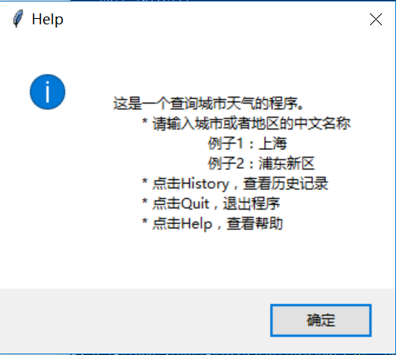

### Messagebox

* showinfo messagebox
```python
def help(self):
    tk.messagebox.showinfo('Help', 'This is a help.')
```

* askyesno messagebox
```
def quit(self):
    if tk.messagebox.askyesno('Quit', 'Are you sure you want to quit?'):
        root.quit()
```