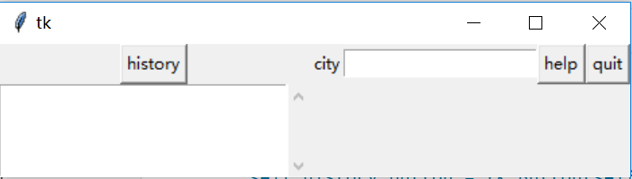
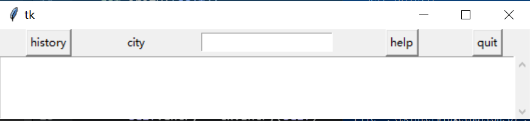
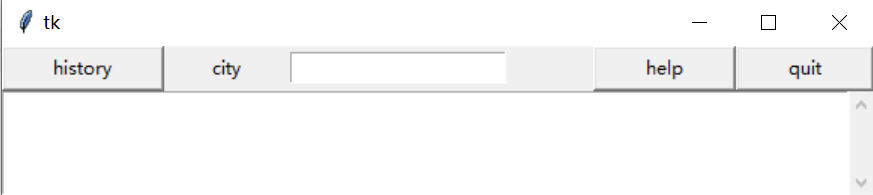
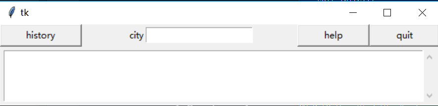

### Grid Geometry Manager

#### Get start from a simple grid
* use **row** and **column** to set the basic position

```python
import tkinter as tk
import tkinter.scrolledtext


class App(tk.Frame):


    def __init__(self, master):
        super().__init__(master)
        self.master = master
        self.pack()
        self.initUI()

    def initUI(self):
        self.history_button = tk.Button(self, text='history')
        self.history_button.grid(row=0, column=0)

        self.label = tk.Label(self, text='city')
        self.label.grid(row=0, column=1)
        self.entry = tk.Entry(self)
        self.entry.grid(row=0, column=2)

        self.help_button = tk.Button(self, text='help')
        self.help_button.grid(row=0, column=3)
        self.quit_button = tk.Button(self, text='quit')
        self.quit_button.grid(row=0, column=4)

        self.scrolledtext = tkinter.scrolledtext.ScrolledText(self, width=30, height=5)
        self.scrolledtext.grid(row=1, column=0)

if __name__ == '__main__':
    root = tk.Tk()
    app = App(root)
    app.mainloop()
```


* use **columnspan** to expand the scrolledtext

```python
self.scrolledtext.grid(row=1, column=0, columnspan=5)
```


* use **sticky** to change the position of a widget in their cells

```python
self.history_button.grid(row=0, column=0, sticky=tk.W+tk.N+tk.S+tk.E)
self.label.grid(row=0, column=1, sticky=tk.E)
self.entry.grid(row=0, column=2, sticky=tk.W)
self.help_button .grid(row=0, column=3, sticky=tk.W+tk.N+tk.S+tk.E)
self.quit_button .grid(row=0, column=4, sticky=tk.W+tk.N+tk.S+tk.E)
```


* use **padx** and **pady** to set horizontal and vertical padding to place around the widget in a cell

```python
self.scrolledtext.grid(row=1, column=0, columnspan=5, padx=5, pady=5)
```



